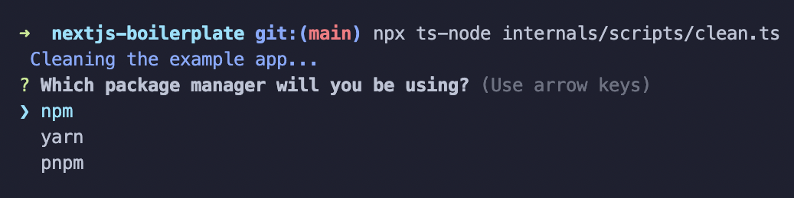

<div align="center">

# Advanced NextJS Boilerplate

Skip the tedious setup of a new NextJS project by using this minimal advanced boilerplate with additional features designed for scalability.

</div>

## Getting Started

You can use any package manager for this project, it was created with npm but is designed to be easily inter-changeable.

You should be able to get started using the `create-next-app` cli.

```shell
npx create-next-app@latest --example https://github.com/SamuelQuinones/nextjs-boilerplate my-app
```

or

```shell
yarn create next-app --example https://github.com/SamuelQuinones/nextjs-boilerplate my-app
```

**In the event that does not work, you can clone the repository or click "Use this template" (as this is a template repo)**

If you're interested you can check out the built in example app

```shell
cd my-app
npm run dev
```

But likely you'll just want to build your own app, to remove the example and get started with your own app:

```shell
npm run cleanAndSetup
```

When prompted, you can select your package manager of choice:



Additionally, this script takes in a single argument meant to be your package manager of choice and skip the prompt altogether, so if you want to use yarn:

```shell
yarn cleanAndSetup yarn
```

## Features

<dl>
  <dt>Typescript</dt>
  <dd>Make sure your code is type-safe and avoid mind-numbing bugs in production, by dealing with silly bugs in development</dd>

  <dt>DOM Utilities</dt>
  <dd>Never write bloated querySelector or element contains functions again thanks to the easy to use utility functions in <code>DomHelper.ts</code></dd>

  <dt>Scaffolding via generators</dt>
  <dd>Create hooks, pages, and API routes right from the command line</dd>

  <dt>Focus on SEO</dt>
  <dd>Thanks to the <code>next-seo</code> library, making your website SEO optimized is easier than ever!</dd>
</dl>
